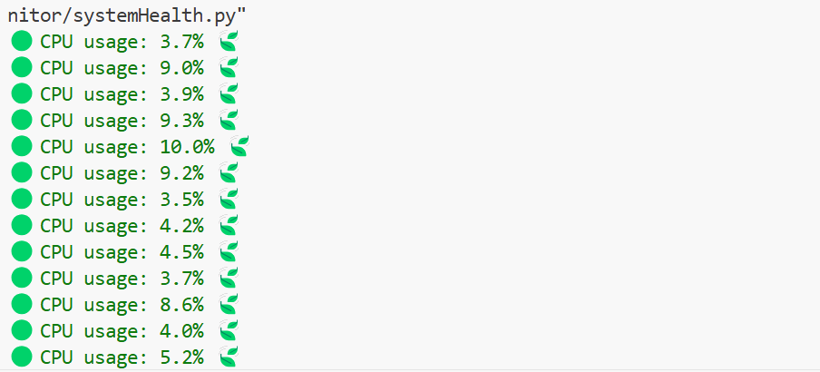

# 🖥️ Real-Time CPU Usage Monitor (Python CLI) 🐍 | psutil | colorama

"This Python command-line utility tracks your CPU usage in real time, showing the percentage in colored output with the help of the colorama and psutil libraries."

💡 Features
=====================================================================
- Real-time CPU usage monitoring
- Color-coded output:
  - 🟢 **Green** for low usage (< 50%)
  - 🟡 **Yellow** for moderate usage (50%–79%)
  - 🔴 **Red** for high usage (80%+)

📦 Requirements | 🐍
====================================================================
Install dependencies using `pip`:

pip install psutil

pip install colorama

💡 Example Output ⭐
===================================================================

